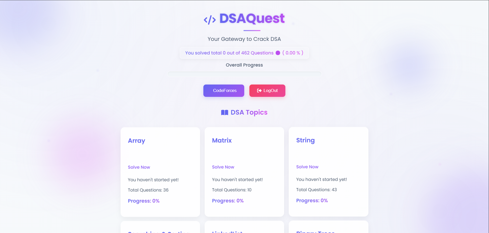
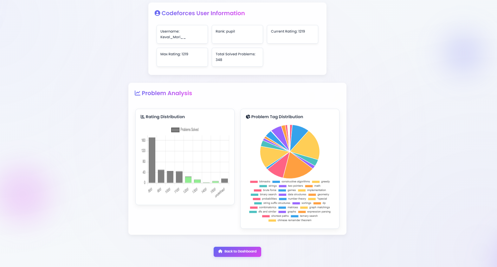
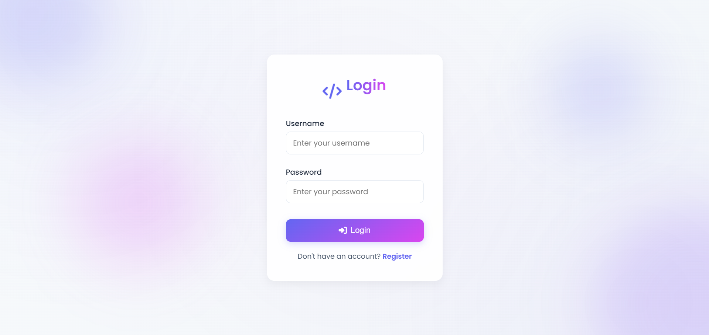
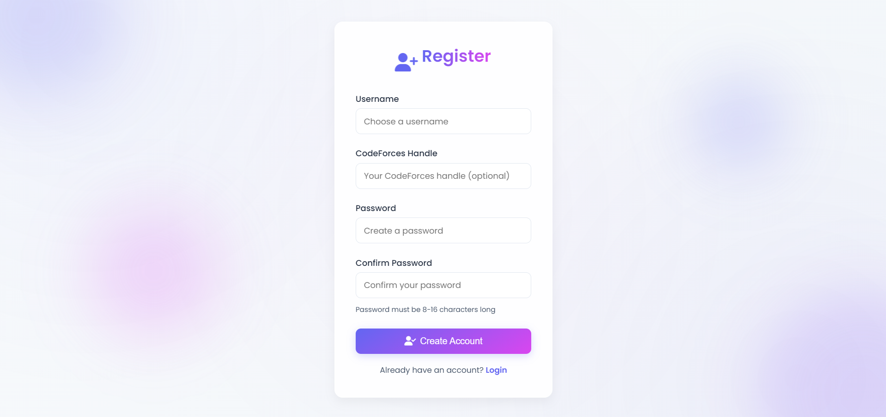
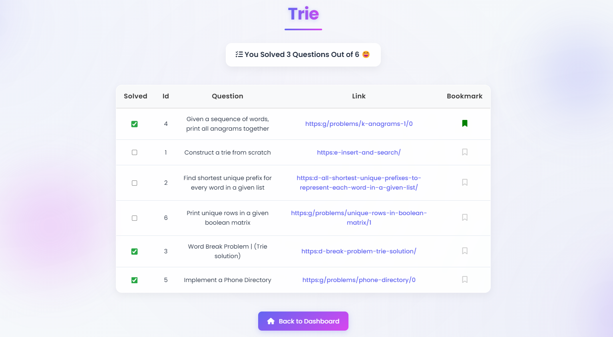

# 🚀 DSAQuest

## 👀 Overview




**DSAQuest** is a clean, responsive, and user-friendly platform designed to help you master **450+ DSA questions**. Built using **vanilla JavaScript, HTML, CSS**, and **API integration**, it's tailored for coding enthusiasts preparing for placements and improving their problem-solving skills.

---

## 🔍 Features

- ✅ Track solved questions across multiple DSA topics
- 📌 Bookmark important questions for later
- 📊 Visualize Codeforces progress using charts
- 🔗 Codeforces API integration (real-time rank, rating & problem stats)
- 🔐 Simple registration & login (localStorage/sessionStorage)
- 🧩 Topic-based question segregation and tracking

---

## 🖼️ Screenshots

### 🏠 Home Page

.png)
.png)

### 🔐 Login Page


### 📝 Registration Page


### 📂 Topic Page


---

## 🧠 How It Works

- 🧑‍💼 On registration, user data is stored securely in `localStorage`
- ✅ Question checkboxes are used to track completion and bookmarks
- 📈 Progress is dynamically calculated topic-wise and globally
- 📡 Codeforces handle fetches:
  - 📊 Rank & Ratings (current and max)
  - 🧮 Solved Problems
  - 📈 Charts based on problem rating and tags

---

## 📈 Future Roadmap

- 🔗 Backend integration for persistent data
- 🔐 Secure user authentication with token-based login
- 🏆 Codeforces-based leaderboard system
- 🔎 Difficulty & tag-based filtering
- 🌙 Dark mode UI toggle

---

## 🛠 Tech Stack

- HTML, CSS, JavaScript
- LocalStorage / SessionStorage
- Codeforces API

---

## 🚀 Getting Started

To run the project locally:

```bash
git clone https://github.com/your-username/dsaquest.git
cd dsaquest
# Open index.html in your browser
